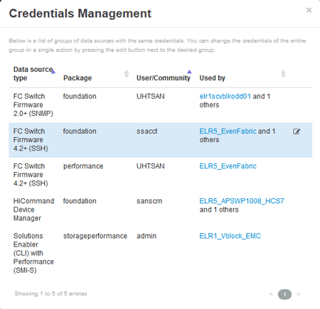

= Cambio de las credenciales de origen de datos
:allow-uri-read: 
:icons: font
:imagesdir: ../media/

[role="lead"]
Si varias fuentes de datos del mismo tipo comparten un nombre de usuario y una contraseña, puede cambiar la contraseña de todos los dispositivos del grupo al mismo tiempo.

== Pasos

. En la barra de herramientas Insight, haga clic en *Admin*.
+
Se abrirá la lista *orígenes de datos*.

. Haga clic en el botón *acciones* y seleccione la opción *Cambiar credenciales*.
. En el cuadro de diálogo Credentials Management, seleccione uno de los grupos de orígenes de datos en la lista.
+
El icono Editar, un bolígrafo en una hoja de papel, se activa a la derecha.

+

. Haga clic en *Editar*.
. Introduzca la nueva contraseña y confírmela.

