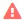

= Determinación del estado de adquisición del origen de datos
:allow-uri-read: 
:icons: font
:imagesdir: ../media/

[role="lead"]
Dado que los orígenes de datos son la fuente principal de información de Insight, es imprescindible que se garantice que permanezcan en estado en ejecución.

La capacidad de ver el estado de adquisición del origen de datos está disponible en cada página de activos para todos los activos adquiridos directamente. Puede ocurrir cualquiera de los siguientes escenarios de adquisición, en los que el estado se muestra en la esquina superior derecha de la página de activos:

* Se ha adquirido correctamente desde el origen de datos
+
Muestra el estado "'adquirido `xxxx``", where `xxxx` indica el tiempo de adquisición más reciente de los orígenes de datos del activo.

* Hay un error de adquisición.
+
Muestra el estado "'adquirido `xxxx``", where `xxxx` indica el tiempo de adquisición más reciente del activo con uno o varios orígenes de datos . Al hacer clic , una ventana muestra cada origen de datos del activo, el estado del origen de datos y la última vez que se adquirieron los datos. Al hacer clic en un origen de datos se muestra la página de detalles del origen de datos.

Si un activo no se adquiere directamente, no se muestra ningún estado.
