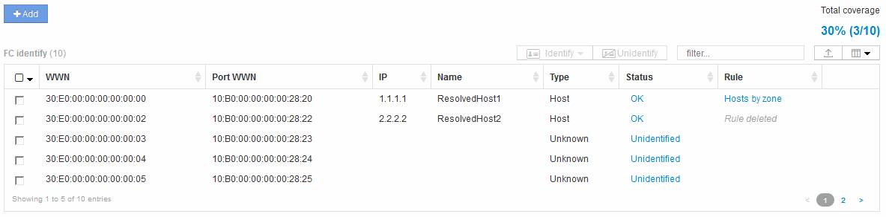

= Resolución de dispositivos Fibre Channel
:allow-uri-read: 
:icons: font
:imagesdir: ../media/

[role="lead"]
La pantalla FC Identify muestra el WWN y el WWPN de dispositivos Fibre Channel cuyos hosts no se han identificado mediante la resolución automática del dispositivo. La pantalla también muestra cualquier dispositivo que se haya resuelto mediante la resolución manual del dispositivo.

Los dispositivos que se han resuelto mediante resolución manual contienen el estado "'OK'" e identifican la regla utilizada para identificar el dispositivo. Los dispositivos que faltan tienen el estado "'no identificados'". En esta página se muestra la cobertura total para la identificación de dispositivos.

Para realizar acciones masivas, seleccione varios dispositivos en el lado izquierdo de la pantalla FC Identify. Las acciones se pueden realizar en un único dispositivo pasando el ratón por encima de un dispositivo y seleccionando los botones identificar o anular la identificación en el extremo derecho de la lista.

El enlace cobertura total muestra una lista del "número de dispositivos identificados/número de dispositivos disponibles" para su configuración:

* Alias de SRM
* Alias de almacenamiento
* Cambiar alias
* Zonas
* Definido por el usuario

