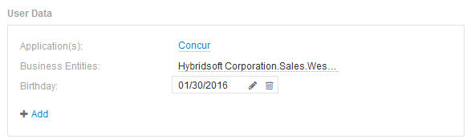

= Datos de usuarios
:allow-uri-read: 
:icons: font
:imagesdir: ../media/

[role="lead"]
Se muestra la sección datos de usuario de una página de activos y permite cambiar cualquier dato definido por el usuario, como aplicaciones, entidades de negocio y anotaciones.

A continuación se muestra un ejemplo de lo que podría mostrarse en la sección datos de usuario de una página de activos de máquina virtual cuando se asigna una aplicación, una entidad de negocio y una anotación al activo:

