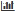

= Utilizando la sección anomalías
:allow-uri-read: 
:icons: font
:imagesdir: ../media/

[role="lead"]
La sección anomalías, que se muestra sólo en una página de activos de aplicaciones, proporciona información sobre la infraestructura de la aplicación y le permite identificar comportamientos anormales que podrían provocar interrupciones en el servicio.

== Pasos

. Active la supervisión de anomalías en la aplicación deseada y permita que ésta recopile datos.
. Mientras el motor de detección de anomalías está en funcionamiento, puede ver la siguiente información en la sección *anomalías* de la página de activos de la aplicación:
+
** La puntuación de detección de anomalías se muestra mediante una barra azul, que representa una puntuación entre 0 y 100. La puntuación se realiza de recurso a recurso y contador, lo que da como resultado una puntuación de significado general para toda la infraestructura de aplicaciones.
** Vista de activos de aplicaciones
+
Ubicado debajo de la puntuación de detección de anomalías, esto muestra cómo todos los activos contribuyen a la puntuación actual de anomalías. Si un activo no está contribuyendo significativamente a la puntuación de anomalías, está representado por image:../media/anomaly-score-none.gif[""]. Si el activo contribuye a la importancia de la puntuación de la anomalía, aparecen 1, 2 o tres barras azules, por ejemplo, image:../media/anomaly-score-contributor.gif[""]. Los valores representados por el número de barras indican la importancia de la contribución de ese activo a la puntuación de anomalías de la siguiente manera: 1 bar = 1-33; 2 barras = 34-67; 3 barras = 68-100.

+
Los activos asignados a una aplicación (hosts, máquinas virtuales, volúmenes, volúmenes internos e hipervisores) y también los activos de la infraestructura que de algún modo están conectados a los activos asignados (por ejemplo, nodos, puertos, etc.) contribuyen a la puntuación de detección de anomalías. Se muestran los activos que contribuyen y los que no contribuyen a la anomalía en particular, porque los datos de los recursos de la aplicación asignados pueden fluir a través de ellos.

+
Si hay más de 60 activos de un tipo, aparece el botón *más*, que puede hacer clic para mostrar los activos restantes. Ese estado de los activos restantes, por ejemplo, image:../media/anomaly-more-status.gif[""], Aparece junto al botón *más*. Este ejemplo indica que de un total de 129 activos no mostrados, 124 de esos activos no contribuyeron a la puntuación de anomalías; sin embargo, cinco de esos activos contribuyeron en cierto grado de importancia a la puntuación de anomalías.

** Gráfico de anomalías
+
El gráfico de anomalías muestra la puntuación de anomalía más alta, indicada por el círculo naranja, para el intervalo de tiempo (3 horas, 24 horas, 3 días, 7 días, 30 días, o un intervalo de tiempo personalizado) seleccionado para la página de activos de la aplicación. Puede arrastrar el puntero sobre el gráfico para ver las puntuaciones de anomalías, indicadas por un círculo azul, para otros puntos durante el intervalo de tiempo y, a continuación, hacer clic en el círculo azul, esta opción actualizará la vista de activos de la aplicación para mostrar los activos que contribuyeron a la puntuación en ese momento.

. Para ayudarle a solucionar problemas de rendimiento de activos, puede agregar un activo desde la vista activos de aplicaciones al gráfico de vista experto de la página activos de aplicaciones haciendo lo siguiente:
+
.. Haga clic en un icono de activo en la vista activos de aplicaciones.
+
A continuación se muestra el nombre del activo, que es un hipervínculo a su página de activos, la métrica que contribuyó a la anomalía, la importancia de la contribución del activo y un botón que permite agregar el activo al gráfico de vista experto.

.. Haga clic en .

+
El activo se agrega al gráfico de vista experto.

