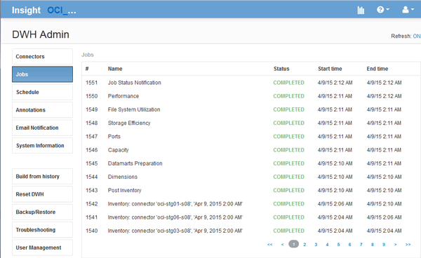

= Gestión de trabajos
:allow-uri-read: 
:icons: font
:imagesdir: ../media/

[role="lead"]
Puede ver una lista de los trabajos actuales y su estado. El primer trabajo de un ciclo de compilación es de tipo negrita. La generación que realiza Data Warehouse para cada conector y para cada data Mart se considera un trabajo.

== Acerca de esta tarea

Puede cancelar cualquier trabajo pendiente que haya programado o iniciado. También puede borrar el historial de trabajos ejecutados anteriormente. Puede borrar el historial de trabajos que no están pendientes, en ejecución ni en proceso de anulación. Puede borrar todo el historial o todo el historial excepto las 24 horas anteriores para eliminar todas las entradas del último día, excepto las del último día.

Puede ver información sobre los siguientes tipos de trabajos: Licencia, preinventario, Inventario, Inventario, Inventario de correos, Dimensiones, Preparación de datamarts, capacidad, puertos, eficiencia del almacenamiento, utilización del sistema de archivos, Rendimiento, notificación de estado de trabajo, creación de historial, anotaciones dinámicas, eliminación de conector, Compilación, Casa telefónica y Mantenimiento omitidos.

Un trabajo de mantenimiento se ejecuta semanalmente y utiliza herramientas MySQL para optimizar la base de datos.

== Pasos

. Inicie sesión en el portal del almacén de datos en `+https://hostname/dwh+`, donde `hostname` Es el nombre del sistema en el que está instalado el almacén de datos de OnCommand Insight.
. En el panel de navegación de la izquierda, haga clic en *trabajos*.
+

+
Si aparece un estado pendiente, aparecerá un enlace Cancelar.

. Para cancelar un trabajo pendiente, haga clic en *Cancelar*.
. Para eliminar el historial de trabajos, haga clic en *todos* o *todos excepto las últimas 24 horas*.

