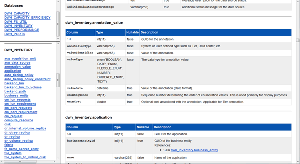

= Visualización del esquema de la base de datos de Data Warehouse
:allow-uri-read: 
:icons: font
:imagesdir: ../media/

[role="lead"]
Es posible que desee ver el esquema de base de datos para comprender cómo usar los datos en otra API o para desarrollar consultas SQL. La opción de esquema muestra todas las bases de datos, tablas y columnas del esquema. También puede revisar los diagramas de esquema de base de datos que muestran las relaciones de tabla.

== Pasos

. Inicie sesión en el portal del almacén de datos en `+https://hostname/dwh+`, donde `hostname` Es el nombre del sistema en el que está instalado el almacén de datos de OnCommand Insight.
. Haga clic en image:../media/oci-7-help-icon-gif.gif[""] En la barra de herramientas de Data Warehouse, y seleccione *Documentación*.
. Seleccione *Esquema de base de datos*.
. Por ejemplo, en el panel *bases de datos*, haga clic en *DWH_INVENTORY*.
. En el panel *todas las tablas*, desplácese hacia abajo hasta la sección *DWH_INVENTORY* y haga clic en la tabla *valor_anotación*.
+

+
Aparece la tabla dwh_Inventory.annotation.

