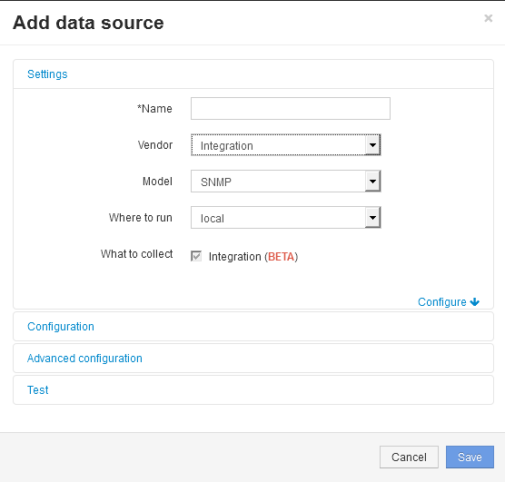

= Creación de un origen de datos de integración SNMP
:allow-uri-read: 
:icons: font
:imagesdir: ../media/

[role="lead"]
El origen de datos de la integración SNMP proporciona propiedades de configuración comunes de SNMP similares a otras fuentes de datos basadas en SNMP incluidas con los orígenes de datos de OnCommand Insight para Brocade y Cisco.

== Antes de empezar

Para poder utilizar correctamente el origen de datos de Integration SNMP para recopilar, se debe cumplir lo siguiente:

* Debe haber importado ya un paquete de integración que utilizará para este origen de datos SNMP.
* Todos los dispositivos de destino comparten las mismas credenciales.
* Todos los dispositivos de destino implementan los objetos SNMP a los que hace referencia el paquete de integración configurado.

== Acerca de esta tarea

Para crear un origen de datos de integración SNMP, elija el proveedor "integración" y el modelo "SNMP" en el asistente de creación de orígenes de datos.

== Pasos

. En la interfaz de usuario web de OnCommand Insight, haga clic en *Administración* > *fuentes de datos*
. Haga clic en *+Agregar*
. Escriba un nombre para el origen de datos
. En Proveedor, seleccione *integración*
. En Modelo, seleccione *SNMP*
+

. Para obtener información sobre qué recopilar, consulte *integración*
+
Este es el único paquete de este origen de datos y se comprueba de forma predeterminada:

. Haga clic en *Configuración*
. Introduzca las direcciones IP para los sistemas desde los cuales se recogerán datos SNMP
. Seleccione un paquete de integración de SNMP importado
. Defina el intervalo de sondeo de integración
. Seleccione la versión de SNMP
. Introduzca la cadena de comunidad SNMP
+
Para SNMP V1 y V2.

. Agregue el nombre de usuario y la contraseña para los sistemas de los que va a recopilar datos.
+
Para SNMP V3.

. Haga clic en *Configuración avanzada*
+
Se muestran los valores predeterminados de Configuración avanzada. Realice los cambios necesarios en esta configuración.

