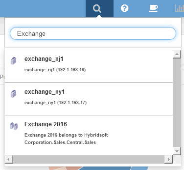

= Analizar un problema de rendimiento de la aplicación
:allow-uri-read: 
:icons: font
:imagesdir: ../media/

[role="lead"]
Este documento describe los pasos que puede seguir para tratar informes de problemas de rendimiento de una aplicación que afectan a usuarios o administradores. Por ejemplo, los usuarios se quejan de que la aplicación Exchange experimenta periodos de lentitud durante el día.

== Acerca de esta tarea

En OnCommand Insight, una aplicación es una entidad configurada. Se asigna un nombre y una entidad de negocio a la aplicación y se asignan recursos informáticos y de almacenamiento a la aplicación. Esto permite una mejor visión integral del estado de la infraestructura y una gestión más proactiva de la gestión de activos de la infraestructura.

== Pasos

. Para comenzar a investigar el problema, utilice la barra de herramientas Insight para realizar una búsqueda global de la aplicación Exchange.
+

+
[TIP]
====
Al realizar una búsqueda, puede agregar un descriptor de objeto antes del nombre del objeto para refinar los resultados de la búsqueda.

====
. Cuando selecciona "Exchange 2016" en los resultados de la búsqueda, el sistema muestra la página de inicio de la aplicación.
+
image::../media/exch2016-land-page.png[página de tierra de la exch2016]

+
En la página de destino de la aplicación, la siguiente información es de su interés:

+
** En el período de 24 horas seleccionado, se muestra un aumento de la latencia a la derecha del gráfico de latencia.
** Durante el periodo de latencia aumentada, no se producen cambios significativos en el nivel de IOPS. Parece que el aumento de la latencia no se debe al uso más pesado de las aplicaciones. En realidad, no observamos una alta demanda de IOPS en el almacenamiento que pudiese justificar el pico de latencia. El aumento de la latencia puede deberse a un factor externo.
** En la parte derecha de los gráficos de la sección Top Contribuits, haga clic en el 100% del volumen interno seleccionado (CDOT_Boston:SP2:Vol_01). El sistema muestra que este recurso está contribuyendo con un 100% a la aplicación Exchange 2016. image:../media/top-contributor.gif[""]
** Haga clic en el enlace de navegación de este volumen interno (CDOT_Boston:SP2:Vol_01) para acceder a la página de destino del volumen interno. El análisis del volumen interno puede proporcionar información relativa al pico de latencia.

