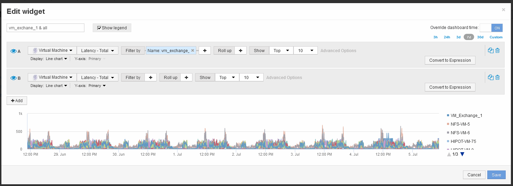

= Compare el total de latencia de un objeto con el total de latencia de los 10 objetos superiores
:allow-uri-read: 
:icons: font
:imagesdir: ../media/

[role="lead"]
Los siguientes pasos comparan el total de latencia de una única máquina virtual con el de las máquinas virtuales que informan del total de latencia más de 10 en toda la infraestructura virtual.

== Pasos

. Añada un widget con un gráfico de líneas al nuevo panel: *Widget* > *Carta de líneas*
+
.. Cambie el dispositivo predeterminado a máquina virtual: Haga clic en *almacenamiento* > *máquina virtual* > *latencia-total*
+
El widget muestra la latencia total, de todas las máquinas virtuales, por las 24 horas predeterminadas en un gráfico de área.

.. Cree una segunda pantalla en este widget que muestre el promedio de latencia total para todas las VM: *Widget* > *Diagrama de línea*
.. Cambie el dispositivo predeterminado a máquina virtual: Haga clic en *almacenamiento* > *máquina virtual* > *latencia-total*
+
El widget muestra el total de latencia para el período de tiempo predeterminado de 24 horas utilizando un gráfico de líneas.

.. Haga clic en *X* en la barra *Roll up* y seleccione *Mostrar* > *Arriba* > *10*

+
El sistema muestra los 10 equipos virtuales principales en función de la latencia - total. 

. Añada el equipo virtual que desee comparar con los 10 primeros:
+
.. Haga clic en *+Agregar*
.. Cambie el dispositivo predeterminado a máquina virtual: Haga clic en *almacenamiento* > *máquina virtual* > *latencia total*
.. Haga clic en *filtro por* > *Nombre* > *$var1*

. Haga clic en *Mostrar leyenda*

== Resultados

Una leyenda identifica cada una de las máquinas virtuales bajo análisis. Puede identificar fácilmente VM_Exchange_1 y determinar si está experimentando una latencia similar a la de los diez equipos virtuales principales del entorno.
