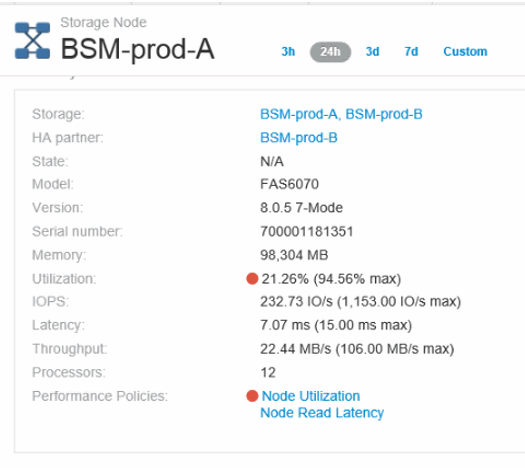
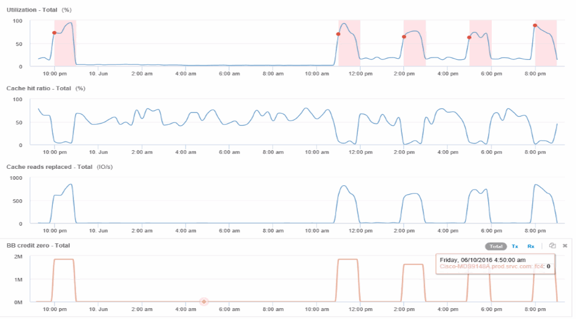

= Crear políticas de rendimiento y umbrales para los puertos
:allow-uri-read: 
:icons: font
:imagesdir: ../media/

[role="lead"]
Es posible crear políticas de rendimiento con umbrales para las métricas asociadas a un puerto. De forma predeterminada, las políticas de rendimiento se aplican a todos los dispositivos del tipo especificado al crearlos. Puede crear una anotación para incluir sólo un dispositivo específico o un conjunto de dispositivos en la política de rendimiento. Para simplificar, no se utiliza ninguna anotación en este procedimiento.

== Antes de empezar

Si desea utilizar una anotación con esta política de rendimiento, debe crear la anotación antes de crear la política de rendimiento.

== Pasos

. En la barra de herramientas Insight, haga clic en *gestionar* > *políticas de rendimiento*
+
Se muestran las políticas existentes. Si existe una política para los puertos de switch, puede editar la política existente y agregar las nuevas políticas y umbrales.

. Edite una política de puertos existente o cree una nueva
+
** Haga clic en el icono de lápiz ubicado en el extremo derecho de la política existente. Añadir los umbrales descritos en los pasos «d» y «e».
** Haga clic en *+Agregar* para agregar una nueva directiva
+
... Agregue un "'Nombre de la política'": Dispositivo de vaciado lento
... Seleccione puerto como tipo de objeto
... Introduzca la primera aparición para "'aplicar después de la ventana'" de
... Introduzca el umbral: BB credit cero - Rx > 1,000,000
... Introduzca el umbral: BB credit cero - Tx > 1,000,000
... Haga clic en «completar el procesamiento de directivas adicionales si se genera una alerta».
... Haga clic en «Guardar».

+
La política que cree supervisa los umbrales establecidos durante un período de 24 horas. Si se supera el umbral, se informa de una infracción.

. Haga clic en *Paneles* > *Panel de infracciones*
+
El sistema muestra todas las infracciones que se han producido en el sistema. Busque u ordene las violaciones para ver las violaciones "dispositivo de vaciado bajo". El panel de infracciones muestra todos los puertos que experimentaron errores de BB Credit 0 que exceden los umbrales definidos en la política de rendimiento. Cada puerto de switch identificado en el panel de infracciones es un enlace resaltado a la página de destino de puertos.

. Haga clic en un enlace de puerto resaltado para mostrar la página de destino del puerto.
+
Se muestra la página de destino del puerto e incluye información útil para solución de problemas de BB Credit 0:

+
** Dispositivos a los que está conectado el puerto
** Identificación del puerto que informa de la infracción, que es un puerto del switch Fibre Channel.
** La velocidad del puerto
** El nodo y el nombre de puerto asociadosimage:../media/port-landing-page.gif[""]

. Desplácese hacia abajo para ver las métricas de puertos. Haga clic en *Seleccionar métricas para mostrar* > *BB credit Zero* para mostrar el gráfico de crédito BB.
+
image::../media/expert-port-metrics.gif[métricas de puertos expertos]

. Haga clic en *correlacionado superior*
+
El análisis de recursos top correlacionado muestra el nodo de la controladora conectada que el puerto sirve como el recurso más correlacionado con el rendimiento. Este paso compara las métricas de IOPS de la actividad del puerto con la actividad general del nodo. La pantalla muestra las métricas Tx y Rx BB Credit Zero y las IOPS del nodo del controlador. La pantalla muestra lo siguiente:

+
** Las I/o de la controladora están altamente relacionadas con el tráfico de puertos
** La política de rendimiento se viola cuando el puerto transmite I/o al servidor.
** Dado que nuestra infracción del rendimiento del puerto se produce junto con una carga de IOPS elevada en la controladora de almacenamiento, es probable que la infracción se deba a la carga de trabajo del nodo de almacenamiento.

. Vuelva a la página de destino de puertos y acceda a la página de destino del nodo de la controladora de almacenamiento para analizar las métricas de cargas de trabajo.
+
El nodo muestra una infracción de utilización y las métricas muestran una alta "lecturas de caché sustituidas" que se correlaciona con estados de crédito cero de búfer a búfer.

+

. En la página de destino del nodo, puede comparar los ceros de crédito de BB seleccionando el puerto de la lista de recursos correlacionados y seleccionando los datos de utilización, incluidos los datos de utilización de caché, para nuestro nodo en el menú de métricas.
+

+
Estos datos hacen evidente que el ratio de aciertos en caché está inversamente correlacionado con otros parámetros. En lugar de ser capaz de responder a la carga del servidor desde la caché, el nodo de almacenamiento experimenta unas lecturas de caché elevadas sustituidas. Es probable que tener que recuperar la mayoría de los datos del disco en lugar de la caché esté provocando el retraso en la transmisión de datos del puerto al servidor. Aparece la causa del problema de rendimiento que es probable que sea un cambio generado por la carga de trabajo en el comportamiento de I/o, y que la caché del nodo y su configuración son la causa. Es posible que el problema se resuelva mediante el aumento del tamaño de la caché del nodo o la modificación del comportamiento del algoritmo de almacenamiento en caché.

