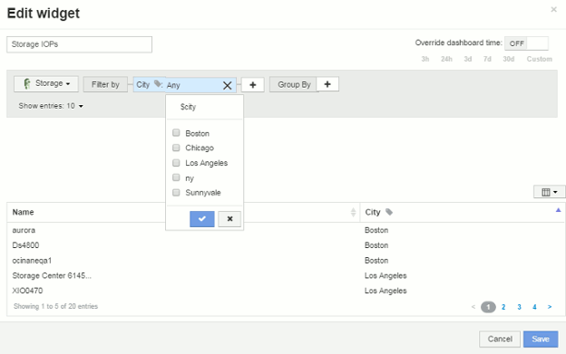

= Variables de panel
:allow-uri-read: 
:icons: font
:imagesdir: ../media/

[role="lead"]
Las variables del panel permiten filtrar datos en varios widgets de un panel de control de forma rápida y sencilla.

== Antes de empezar

Este ejemplo requiere que la anotación *Ciudad* (también denominada atributo Ciudad) se configure en múltiples activos de almacenamiento.

Para obtener mejores resultados, establezca diferentes ciudades en diferentes almacenamientos.

== Acerca de esta tarea

Las variables proporcionan una forma rápida y sencilla de filtrar los datos que se muestran en algunos o todos los widgets de un panel personalizado. Los siguientes pasos le guiarán para crear widgets que utilizan variables y le mostrarán cómo usarlos en el panel de control.

== Pasos

. Inicie sesión en Insight como usuario con permisos administrativos
. Haga clic en *Paneles* > *+Nuevo panel*.
. Antes de agregar widgets, queremos definir las variables que utilizaremos para filtrar los datos del panel. Haga clic en el botón *variable*.
+
Se muestra la lista de atributos.

. Digamos que queremos configurar el panel para que filtre en función de la ciudad. Seleccione el atributo *Ciudad* de la lista.
+
El campo de variable $City se crea y se agrega al panel de control.

. A continuación, debemos decir a nuestros widgets que usen esta variable. La forma más sencilla de ilustrar esto es añadir un widget de tabla que muestre la columna Ciudad. Haga clic en el botón *Widget* y seleccione el widget *Tabla*.
. Primero, agregue el campo Ciudad a la tabla seleccionándolo en el selector de columnas image:../media/column-picker-button.gif[""] botón.
+
Ciudad es un atributo de tipo de lista, por lo que contiene una lista de opciones previamente definidas. También puede elegir atributos de texto, booleano o de tipo fecha.

. A continuación, haga clic en el botón *Filtrar por +* y elija *Ciudad*.
. Haga clic en *cualquiera* para ver las posibles opciones de filtro para Ciudad. Observe que la lista incluye ahora «»$City» en la parte superior, además de todas las opciones disponibles anteriormente. Seleccione «»$City» para utilizar esta variable de panel.
+
La opción «»$City» solo aparece aquí si se definió previamente en la página del panel principal. Si la variable no estaba definida previamente, sólo se mostrarán las opciones existentes para el filtro. Sólo las variables que se aplican al tipo de atributo seleccionado se mostrarán en el menú desplegable de ese filtro.

+

. *Guardar* el widget.
. En la página del panel, haga clic en *Any* junto a la variable $City y seleccione la ciudad o ciudades que desee ver.
+
El widget de tabla se actualiza para mostrar únicamente las ciudades seleccionadas. Puede cambiar los valores de la variable $City a voluntad, y todos los widgets del panel que estén configurados para utilizar la variable $City se actualizarán automáticamente para mostrar sólo los datos de los valores seleccionados.

. Asegúrese de *Guardar* su panel cuando lo tenga configurado como desee.

