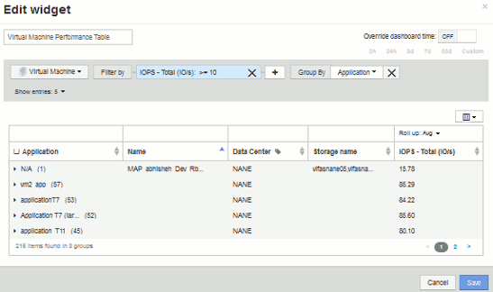

= Consola personalizada: Rendimiento de máquina virtual
:allow-uri-read: 
:icons: font
:imagesdir: ../media/

[role="lead"]
Los widgets y los paneles personalizados de OnCommand Insight ayudan a ofrecer vistas operativas sobre las tendencias de inventario y rendimiento.

== Acerca de esta tarea

Las operaciones DE TI se enfrentan actualmente a muchos desafíos. A los administradores se les pide que hagan más con menos, y es imprescindible tener una total visibilidad de los centros de datos dinámicos. En este ejemplo, le mostraremos cómo crear un panel personalizado con widgets que le ofrezcan información operativa sobre el rendimiento de la máquina virtual en su entorno. Al seguir este ejemplo y crear widgets para abordar sus propias necesidades específicas, podrá visualizar el rendimiento del almacenamiento back-end en comparación con el rendimiento de las máquinas virtuales (VM) front-end o ver la latencia de las máquinas virtuales frente a la demanda de I/O.

Los paneles personalizados le permiten priorizar los esfuerzos e identificar la disponibilidad de los recursos. Puede responder al flujo y flujo de cargas de trabajo, y minimizar el tiempo para detectar y resolver problemas emergentes. Los paneles personalizados le permiten crear vistas priorizadas en la infraestructura crítica para el negocio y son útiles para identificar la disponibilidad del rendimiento en tecnologías de múltiples proveedores.

Aquí crearemos un panel de rendimiento de equipos virtuales que contenga lo siguiente:

* Una tabla con los nombres de las máquinas virtuales y los datos de rendimiento
* Un gráfico donde se compara la latencia de los equipos virtuales con la latencia del almacenamiento
* Un gráfico donde se muestran las IOPS de lectura, escritura y total para las máquinas virtuales
* Un gráfico que muestra el rendimiento máximo de sus máquinas virtuales

Este es sólo un ejemplo básico. Puede personalizar su consola para resaltar y comparar los datos de rendimiento que elija para sus propias prácticas recomendadas operativas.

== Pasos

. Inicie sesión en Insight como usuario con permisos administrativos.
. En el menú *Paneles*, seleccione *+Nuevo panel*.
+
Se abrirá la página Nuevo panel.

. Demos un nombre significativo a nuestro panel. Haga clic en *Guardar*. En el campo *Nombre*, escriba un nombre único para el panel, por ejemplo «'VM Performance by Application'».
. Haga clic en *Guardar* para guardar el panel con el nuevo nombre.
. Comencemos a agregar nuestros widgets. Si es necesario, deslice el interruptor *Edit* a "'on'" para activar el modo de edición.
. Haga clic en el botón *Widget* y seleccione *widget de tabla* para añadir un nuevo widget de tabla al panel.
+
Se abrirá el cuadro de diálogo Editar widget. El nombre predeterminado es "'Widget 1'" y los datos predeterminados mostrados son para todos los almacenamientos de su entorno.

+
image::../media/customdash-vm-table-1.gif[tabla de equipos virtuales 1 de customdash]

. Podemos personalizar este widget. En el campo Nombre, elimine "'Widget 1'" e introduzca "'Tabla de rendimiento de la máquina virtual'".
. Haga clic en la lista desplegable de tipo de activo y cambie *almacenamiento* a *máquina virtual*.
+
Los datos de la tabla cambian para mostrar todas las máquinas virtuales del entorno. Por ahora, la tabla solo muestra los nombres de las máquinas virtuales. Vamos a añadir algunas columnas a la tabla.

. Haga clic en *columnas*image:../media/column-picker-button.gif[""] Y seleccione _Data Center_, _Storage name_ y _IOPS - total_. También puede intentar escribir el nombre en la búsqueda para mostrar rápidamente los campos deseados.
+
Estas columnas se muestran ahora en la tabla. Puede ordenar la tabla por cualquiera de estas columnas. Tenga en cuenta que las columnas se muestran en el orden en el que se agregaron al widget.

. En este ejercicio excluiremos los equipos virtuales que no se utilicen de forma activa, así que vamos a filtrar cualquier cosa con menos de 10 000 IOPS en total. Haga clic en el botón "" + "junto a *filtro por* y seleccione__IOPS - total (IO/s)___. Haga clic en *any* y escriba «'10'» en el campo *de*. Deje el campo *a* vacío. Haga clic en la image:../media/check-box-ok.gif[""] para guardar el filtro.
+
La tabla ahora solo muestra máquinas virtuales con una tasa de IOPS total de 10 o más.

. Podemos contraer la tabla aún más agrupando los resultados. Haga clic en el botón "" + "" situado junto a *Agrupar por* y seleccione un campo para agrupar por, como aplicación o clúster. La agrupación se aplica automáticamente.
+
Las filas de la tabla ahora se agrupan según su configuración. Puede expandir y contraer los grupos según sea necesario. Las filas agrupadas muestran datos acumulados para cada una de las columnas. Algunas columnas permiten elegir el método de despliegue para esa columna.

+

. Cuando haya personalizado el widget de tabla a su satisfacción, haga clic en el botón *Guardar*.
+
El widget de tabla se guarda en el panel.

. Puede cambiar el tamaño del widget en el panel arrastrando la esquina inferior derecha. Ampliar el widget para mostrar claramente todas las columnas. Haga clic en *Guardar* para guardar el panel actual.
. A continuación, añadiremos algunos gráficos para mostrar nuestro rendimiento de máquina virtual. Vamos a crear un gráfico de líneas en el que se compara la latencia de VM con la latencia de almacenamiento.
. Si es necesario, deslice el interruptor *Edit* a "'on'" para activar el modo de edición.
. Haga clic en el botón *Widget* y seleccione *Carta de líneas* para añadir un nuevo widget de gráfico de líneas al panel.
+
Se abrirá el cuadro de diálogo Editar widget. Haga clic en el campo *Nombre* y asigne a este widget el nombre "'VM vs Storage Max Latency'".

. Seleccione *Virtual Machine* y elija *latencia - Máx*. Configure los filtros que desee o deje *filtro por* vacío. Para *Roll up*, elija «um» por «All». Mostrar estos datos como ** Line Chart** y dejar el eje y como *Principal*.
. Haga clic en el botón *+Add* para agregar una segunda línea de datos. Para esta línea, seleccione *almacenamiento* y *latencia - Máx*. Configure los filtros que desee o deje *filtro por* vacío. Para *Roll up*, elija «um» por «All». Mostrar estos datos como ** Line Chart** y dejar el eje y como *Principal*.
+
image::../media/customdash-latencywidgetsettings.gif[customdash latencywidgetsettings]

. Haga clic en *Guardar* para agregar este widget al panel de control.
. A continuación, añadiremos un gráfico que muestre VM Read, Write y total IOPS en un único gráfico.
. Haga clic en el botón *Widget* y seleccione *Gráfico de área* para añadir un nuevo widget de gráfico de área al panel.
+
Se abrirá el cuadro de diálogo Editar widget. Haga clic en el campo *Nombre* y asigne a este widget el nombre "'VM IOPS'".

. Seleccione *Virtual Machine* y elija *IOPS - total*. Configure los filtros que desee o deje *filtro por* vacío. Para *Roll up*, elija «um» por «All». Visualice estos datos como ** Area Chart** y deje el y-Axis como *Primary*.
. Haga clic en el botón +Agregar para agregar una segunda línea de datos. Para esta línea, seleccione *Virtual Machine* y elija *IOPS - Read*. Dejar el eje y como *primario*.
. Haga clic en el botón +Agregar para agregar una tercera línea de datos. Para esta línea, seleccione *Virtual Machine* y elija *IOPS - Write*. Dejar el eje y como *primario*.
+
image::../media/custom-dashboard-vm-iops-chart.gif[gráfico custom dashboard vm iops]

. Haga clic en *Guardar* para agregar este widget al panel de control.
. A continuación, añadiremos un gráfico que muestre el rendimiento de los equipos virtuales de cada aplicación asociada al equipo virtual. Utilizaremos la función de acumulación para ello.
. Haga clic en el botón *Widget* y seleccione *Carta de líneas* para añadir un nuevo widget de gráfico de líneas al panel.
+
Se abrirá el cuadro de diálogo Editar widget. Haga clic en el campo *Nombre* y asigne a este widget el nombre "'rendimiento de VM por aplicación'".

. Seleccione *Virtual Machine* y elija *capacidad de procesamiento - total*. Configure los filtros que desee o deje *filtro por* vacío. En *Roll up*, elija «Max» y seleccione por «Application» o «Name». Muestre las aplicaciones *10* principales. Mostrar estos datos como ** Line Chart** y dejar el eje y como *Principal*.
+
image::../media/customdashboard-vmthroughputsettings.gif[vmthroughput de consola de clientes]

. Haga clic en *Guardar* para agregar este widget al panel de control.
. Puede mover widgets manteniendo pulsado el botón del ratón en cualquier lugar de la parte superior del widget y arrastrándolo a una nueva ubicación. Puede cambiar el tamaño de los widgets arrastrando la esquina inferior derecha. Asegúrese de *Guardar* el panel después de realizar los cambios.
+
Su última consola de rendimiento de la máquina virtual tendrá el siguiente aspecto:

+
image::../media/customdashboard-vm-performance-dashboard.png[consola de rendimiento de máquinas virtuales del panel personalizado]

