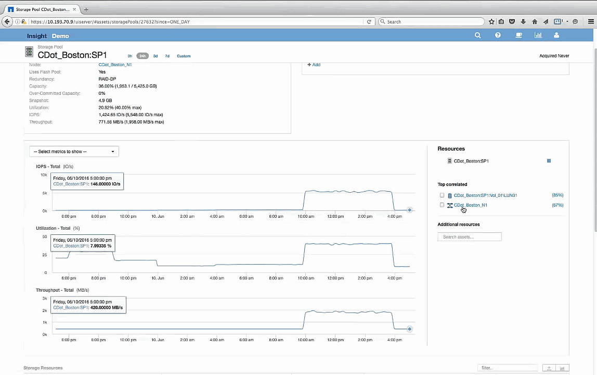

= Examine el pool de almacenamiento
:allow-uri-read: 
:icons: font
:imagesdir: ../media/

[role="lead"]
Al examinar la página de destino del pool de almacenamiento se muestra el mismo pico de IOPS que se observa en sus activos correlacionados. En la sección Recursos puede ver que esta página de destino de la agrupación de almacenamiento enlaza con el volumen de la aplicación de viaje. Haga clic en el volumen para abrir la página de destino de volumen.

