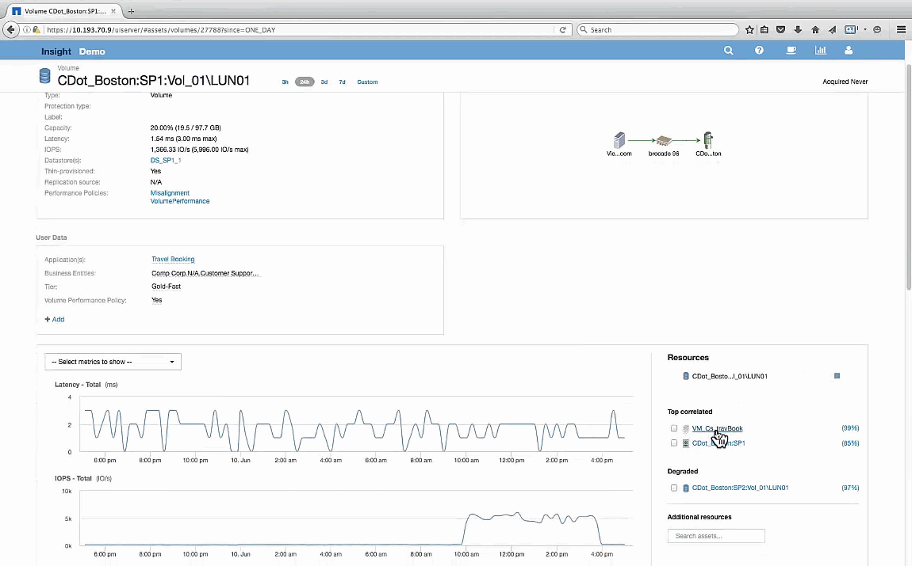

= Examen del volumen
:allow-uri-read: 
:icons: font
:imagesdir: ../media/

[role="lead"]
La página de destino para volúmenes muestra el mismo pico de IOPS conocido que se ve en sus activos correlacionados.

En la sección de recursos se identifica el VM para la aplicación Reserva de viaje. Haga clic en el enlace de la máquina virtual para ver la página de destino de la máquina virtual.
