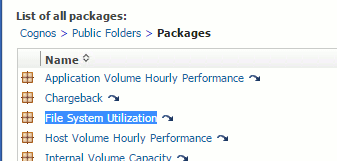

= Pago por uso y creación de informes del sistema de ficheros
:allow-uri-read: 
:icons: font
:imagesdir: ../media/

[role="lead"]
El pago por uso de los sistemas de ficheros siempre se realiza desde la perspectiva del almacenamiento. Las cabinas de almacenamiento asociadas con las máquinas virtuales anotadas para un grupo de recursos informáticos en particular se incluirán en los informes de pago por uso de ese grupo de recursos.

== Antes de empezar

Las máquinas virtuales que desea incluir en el pago por uso de sistemas de archivos deben anotarse con el nombre del grupo de recursos informáticos correspondiente. Las cabinas de almacenamiento asociadas con dichas máquinas virtuales deben anotarse con las anotaciones de nivel adecuadas. La ETL al almacén de datos debe haberse producido una vez que se han establecido estas anotaciones.

== Pasos

. Abra un explorador al servidor de informes, normalmente `https://<host or IP>:9300/p2pd``http://<host or IP\>:9300/bi (7.3.3 or later)` e inicie sesión.
. Elija el paquete *utilización del sistema de archivos* y cree un nuevo informe.
+

. Arrastre y suelte elementos de sus data mart(s) para crear su informe.
+
El siguiente ejemplo es un informe muy simple. Puede crear informes complejos basados en sus necesidades empresariales específicas.

+
image::../media/fs-simple-rpt.gif[rpt simple]

