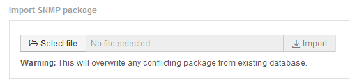

= Importación de paquetes de integración SNMP
:allow-uri-read: 
:icons: font
:imagesdir: ../media/

[role="lead"]
Los paquetes de integración de SNMP se importan en OnCommand Insight mediante la interfaz de usuario web. Los paquetes de integración se identifican por el valor "integraciónPackName" definido en la `integration.json` Archivo de configuración contenido en el archivo ZIP.

== Antes de empezar

Debe haber creado un archivo ZIP con el formato correcto que contenga el paquete de integración que desea importar al servidor OnCommand Insight.

== Acerca de esta tarea

Siga estos pasos para importar paquetes de integración SNMP al servidor de Insight.

== Pasos

. Haga clic en *Admin* > *Setup* > *integración SNMP*
+
El sistema muestra la pantalla Importar paquete SNMP: 

. Haga clic en *Seleccionar archivo* para seleccionar el archivo local que contiene el paquete SNMP.
+
El archivo seleccionado aparece en el cuadro Archivo.

+
[NOTE]
====
Se sobrescribe cualquier paquete de integración existente con el mismo nombre.

====
. Haga clic en *Importar*
+
El archivo se importa al servidor de Insight.

