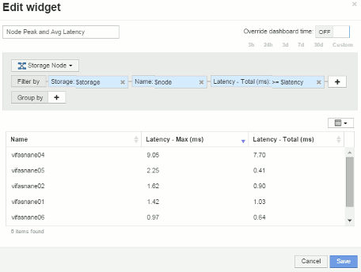

= Configuración de ejemplo del widget de panel de nodos
:allow-uri-read: 
:icons: font
:imagesdir: ../media/

[role="lead"]
Configuración del widget para el panel de control de nodos con ejemplo de variables.

A continuación, se muestran los ajustes de cada widget en el ejemplo del panel del nodo de almacenamiento.

Uso del nodo:

image:../media/nodeutilchart.gif[""] image:../media/nodeutiltable.gif[""]

Latencia de los nodos:

image:../media/nodelatencychart.gif[""] 

Utilización del pool de almacenamiento:

image:../media/poolutilchart.gif[""] image:../media/poolutiltable.gif[""]

Rendimiento del pool de almacenamiento:

image:../media/poolthroughputchart.gif[""] image:../media/poolthroughputtable.gif[""]

Latencia del volumen:

image:../media/vollatencychart.gif[""] image:../media/vollatencytable.gif[""]

IOPS de volumen:

image:../media/voliopschart.gif[""] image:../media/voliopstable.gif[""]
